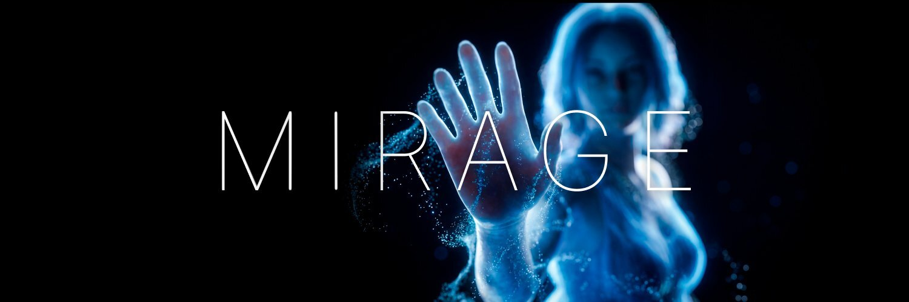

  

<h1 align="center">Mirage</h1>

  <b>Open-source video generation research</b> 
  <i>Proving that open models can surpass closed-source alternatives</i>

  
  
  

---

## Mission

We challenge the assumption that state-of-the-art AI requires closed development. Through rigorous methodology—consistency distillation, targeted data curation, and progressive training protocols—we demonstrate that open-source video generation can exceed proprietary systems.

Our work is guided by a simple principle: genuine innovation flourishes through collaboration and sharing. We release model weights and inference code to enable community adoption and iteration.

## Research

### Alice

A 14-billion parameter text-to-video model achieving state-of-the-art quality through score-regularized consistency distillation (rCM).

| Metric | Result |
|--------|--------|
| VBench Score | **91.2** (surpassing Veo3 ~90, Sora2 ~88) |
| Inference Steps | 4 (7× reduction from 50-step baseline) |
| Resolution | 720p at 24fps |

**Key contributions:**
- Demonstration that distillation can be quality-enhancing, not merely compression
- Synthetic data curation pipeline with hard example mining for systematic failure modes
- Progressive training protocol combining consistency enforcement with score regularization

→ [Repository](https://github.com/mirage-video/Alice) · [Model Weights](https://huggingface.co/gomirageai/Alice-T2V-14B-MoE)

## Vision

The quality gap between open and closed-source video generation is not a gap in architecture or scale—it is a gap in methodology. We aim to close it.

We envision a future where high-quality video generation is accessible to all: researchers iterating on architectures, creators building new tools, developers integrating generation into applications. Infrastructure owned collectively, not gated behind APIs with opaque terms and shifting pricing.

Open-source AI can have the same quality as closed AI. The difference is in who controls it.

## Team

| Contributor | Role |
|-------------|------|
| [Wang Xiaoyu](https://github.com/wangxia0yu) | Lead Researcher |
| [Chen Zhao](https://github.com/chenseris) | Systems Engineer |

## Links

- **Website**: [gomirage.ai](https://gomirage.ai)
- **Twitter/X**: [@gomirageai](https://x.com/gomirageai)
- **Alice Repository**: [github.com/mirage-video/Alice](https://github.com/mirage-video/Alice)
- **Model Weights**: [HuggingFace](https://huggingface.co/gomirageai/Alice-T2V-14B-MoE)

---

  <i>The gap between open and closed video generation is not insurmountable. We intend to prove it.</i>

